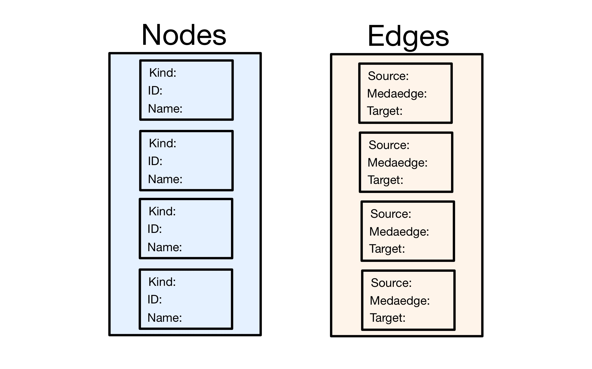
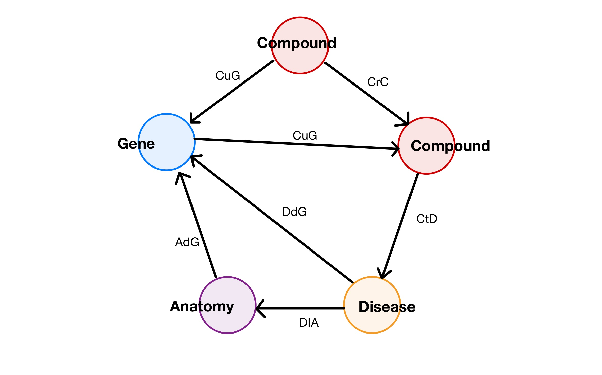

# 📖 Project Document

## 📐 MongoDB Design Diagram

## 📐 Neo4j Design Diagram

## 🖥️ All Queries

### 📚 Query One (MongoDB)

- `disease_name = result["name"]` (Line 20)
- `edges.find({"metaedge": "CtD", "target": disease_id})` (Line 22)
- `nodes.find_one({"id": id})["name"]` (Line 26)
- `edges.find({"source": disease_id, "metaedge": {"$in": ["DdG", "DuG"]}})` (Line 28)
- `nodes.find_one({"id": id})["name"]` (Line 32)
- `edges.find({"source": disease_id, "metaedge": "DlA"})` (Line 34)
- `nodes.find_one({"id": id})["name"]` (Line 38)

### 🌐 Query Two (Neo4j)

- `graph.run('''MATCH (d:Disease{{id:'{}'}})-[:DlA]->(a:Anatomy)-[:AuG|:AdG]->(g:Gene)<-[:CdG|:CuG]-(dc:Compound)-[:CrC*0..1]-(c:Compound)WHERE NOT (c)-->(d) AND ( (a)-[:AdG]->(g)<-[:CuG]-(dc) OR (a)-[:AuG]->(g)<-[:CdG]-(dc))RETURN collect(Distinct c.name)'''.format(new_disease_id))` (Line 50)

## 🚀 Potential Improvements

### 🌐 Improvements for Query 1 (MongoDB)

- Potnetial improvement is to have a collectin for each kind of node. This would shorten the time it takes to search for all the compounds, genes, and anatomies that are related to the disease.

- deploying the database on the cloud would allow for faster queries due to sharding techniques.

### 📚 Improvements for Query 2(Neo4j)

- It would be benificial to use "Read Replicas" to optimize for read-heavy workloads. However, since we deployed the database locally we were unable to utilize this feature.

# Project Instructions

Build a database system to model HetioNet.(MongoDb & Neo4j)

## Instructions

The database should at least answer the following questions in the quickest response time:

1. Given a disease id, what is its name, what are drug names that can treat or palliate this disease, what are gene names that cause this disease, and where does this disease occur? Obtain and output this information in a single query.

2. We assume that a compound can treat a disease if the compound up-regulates/down-regulates a gene, but the location down-regulates/up-regulates the gene in an opposite direction where the disease occurs. Find all compounds that can treat a new disease (i.e. this missing edges between compound and disease excluding existing drugs). Obtain and output all drugs in a single query.

## Requirements

- A Python command-line client interface for database creation and query

- Use at least two types of NoSQL stores

  - Document (MongoDB/PyMongo)
  - Graph (Neo4j/Py2neo)
  - Key-value
  - Column Family (Cassandra/DataStax Python Driver)

- Document

  - Design diagram
  - All queries
  - Potential improvements (i.e. how to speed up the query)

- All source code (sent by email)

- Two-person team

## Rubric

- Database design: 30%

  - Rationale: 15%
  - Implementation: 15%

- Query Functionality: 40%

  - Each query: 20%

- Client interface: 20%

  - GUI: 10 points

- Presentation: 10%

## Due Dates

Project: Thursday, October 12 at 11:59pm

Project Demo: Friday, October 13 at 10:00am - 11:30am

## Sample CSV Files for Testing

nodes.csv
id,name,kind
Anatomy::UBERON:0000002,uterine cervix,Anatomy
Disease::DOID:0050156,idiopathic pulmonary fibrosis,Disease
Gene::1,A1BG,Gene
Compound::DB00014,Goserelin,Compound
Compound::DB00035,Desmopressin,Compound

edges.csv
source,metaedge,target
Disease::DOID:0050156,DdG,Gene::1
Compound::DB00035,CuG,Gene::1
Compound::DB00035,CrC,Compound::DB00014
Compound::DB00014,CtD,Disease::DOID:0050156
Compound::DB00014,CuG,Gene::1
Disease::DOID:0050156,DlA,Anatomy::UBERON:0000002
Anatomy::UBERON:0000002,AdG,Gene::1

# Neo4j Queries for Testing

To delete all nodes and relationships:
MATCH (n)
DETACH DELETE n

To show all nodes and relationships:
MATCH (n)
RETURN n
